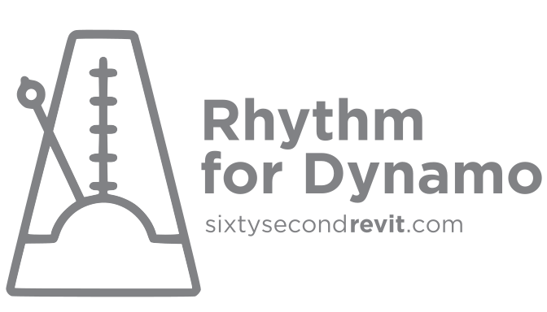

Rhythm is a collection of custom nodes for the [Dynamo](http://www.dynamobim.org) visual programming environment. The idea is this package helps users maintain Rhythm in Revit with Dynamo. It primarily consists of out of the box Dynamo nodes used in clever ways as they apply to the Revit environment.

If you appreciate the work put into this free package, please vote in support of it on Dynamo's package manager.

## Current Version
Rhythm is currently built against the latest Dynamo stable build. At this time that is 2.0.1.

## Contributors
This package is currently managed by author of http://sixtysecondrevit.com.

## Updates
Since there is not currently an update notification process on Dynamo's package manager, I post notifications for updates on twitter.

## Examples
Luke Johnson (whatrevitwants) recently invited several Dynamo developers to co-author a site that can serve as an encyclopedia of nodes. Examples for Rhythm can be found at that site [here](https://dynamonodes.com/2017/12/10/rhythm-node-index/).

## Help improve Rhythm
If you're interested in contributing to Rhythm, just submit a [pull request](https://github.com/sixtysecondrevit/RhythmForDynamo/pulls).

## Thank you!
