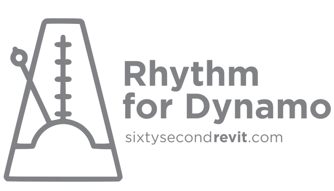

## 📢 Latest Announcements

### `View3d.SetSectionBox` and `View.SetCropBox` have been removed. These nodes were becoming too difficult to support due to [persistent dynamo issues with bounding boxes](https://forum.dynamobim.com/t/problem-setting-crop-boxes-and-section-boxes-in-revit-2022/70045/29).

---

<h1 align="center">
  <br>
  
  <br>
</h1>

<h3 align="center">A collection of custom nodes for <a href="http://dynamobim.org/" target="_blank">Dynamo</a>.</h4>

<p align="center">
  <a href="https://getyarn.io/yarn-clip/e2546962-768f-4e04-a4e6-5e51a3025f8d">
   
  </a>
</p>

---

[](https://github.com/johnpierson/RhythmForDynamo/graphs/commit-activity)

If you appreciate the work put into this free package, please vote in support of it on Dynamo's package manager. 

## Disclaimer
This tool is not affiliated with Autodesk and was written and provided in a personal capacity by the author. This tool is provided "as is" without warranty of any kind, express or implied. Use at your own risk. By using this open-source tool, you acknowledge that the developers and contributors are not liable for any damages, losses, or issues that may arise from its use. You are responsible for ensuring compliance with all applicable laws and regulations. Remember, open-source software relies on community contributions, so functionality and security might vary. Always review, understand, and, if necessary, modify the code to suit your specific needs.

## License
[](https://github.com/johnpierson/RhythmForDynamo/blob/master/LICENSE)
Rhythm is licensed under the BSD 3 Clause License. You can use this package however you want in Dynamo. It's just limited in the way the source code may be used. A simplified version of this license is available [here](https://www.tldrlegal.com/license/bsd-3-clause-license-revised).

## Current Version
 Supported Revit versions are 2020 and up. And supported Dynamo versions are Dynamo 2.0.x and up. Rhythm is deployed from github, and auto-downloads the correct node libraries on the fly. 

For Revit 2027, Rhythm no longer ships the legacy `*.customization.dll` icon assemblies because .NET 10 disables the legacy bitmap resource loading path they relied on. The package still downloads the main node libraries and customization XML files for 2027.

## Components
Rhythm consists of several sub-libraries. These are describe a bit more in detail below.
- [Rhythm Core](https://github.com/johnpierson/RhythmForDynamo/tree/master/src/RhythmCore), General methods and helpers with no reliance on Revit.
- [Rhythm Revit](https://github.com/johnpierson/RhythmForDynamo/tree/master/src/RhythmRevit), All the Revit nodes, built for Revit 2020-2027.
- [Rhythm UI](https://github.com/johnpierson/RhythmForDynamo/tree/master/src/RhythmUI), Revit UI Nodes.
- [Rhythm View Extension](https://github.com/johnpierson/RhythmForDynamo/tree/master/src/RhythmViewExtension), this view extension allows for the auto-annotating of Rhythm nodes and control of the run mode when the user places `Background Document` nodes.
- [Rhythm Python](https://github.com/johnpierson/RhythmForDynamo/tree/master/RhythmPython), Python code for many of the popular Rhythm  nodes. <sub><sup>if you want to hurt my feelings and not use the Rhythm package :pleading_face: </sub></sup>

## Known Issues
- Nodes that interact with background opened documents take some more consideration. This includes running Dynamo graphs that use them in manual run mode and often times closing and opening dynamo after the process is complete. The reason this happens is Dynamo has limited document switching capability and we are exploiting this with those nodes. (Included Nodes: Applications.OpenDocumentFile, Applications.CloseDocument)

## Contributors
This package is primarily managed by the author of http://designtechunraveled.com with additional contributions from [People Like You™](https://github.com/johnpierson/RhythmForDynamo/graphs/contributors).

## Special Thanks

Thanks to Jetbrains for supplying an open-source license of Resharper for this library. More info about Jetbrains Open-Source & Resharper can be found <a href="https://www.jetbrains.com/community/opensource/?utm_campaign=opensource&utm_content=approved&utm_medium=email&utm_source=newsletter&utm_term=jblogo#support"> here</a>.

## Updates
Since there is not currently an update notification process on Dynamo's package manager, I post notifications for updates on twitter.
[](https://twitter.com/johntpierson)

## Examples
Examples will be available on the [wiki](https://github.com/johnpierson/RhythmForDynamo/wiki) soon,

## Building Rhythm

You need Visual Studio 2022 or newer (for MSBuild — `dotnet build` cannot compile the `.resx` files that hold the node icons), and the .NET SDKs for **8.0** and **10.0**. You do **not** need Revit installed: the Revit and Dynamo APIs all come from NuGet.

### Configurations

One codebase covers Revit 2020–2027, so every project has sixteen configurations — `Debug R20`…`Debug R27` and `Release R20`…`Release R27`. The configuration picks the target framework, the Revit and Dynamo package versions, and the `R2x` / `R2x_OR_GREATER` compiler constants used for version-specific code:

| Configuration | Revit | Target framework |
|---|---|---|
| R20 – R24 | 2020 – 2024 | `net48` |
| R25 – R26 | 2025 – 2026 | `net8.0-windows` |
| R27 | 2027 | `net10.0-windows` |

Building one Revit year looks like this:

```powershell
msbuild src/RhythmCore/RhythmCore.sln  /p:Configuration="Release R24" /p:Platform="Any CPU" /t:Restore,Build
msbuild src/RhythmRevit/RhythmRevit.sln /p:Configuration="Release R24" /p:Platform="Any CPU" /t:Restore,Build
msbuild src/RhythmUI/RhythmUI.sln       /p:Configuration="Release R24" /p:Platform="Any CPU" /t:Restore,Build
```

**Order matters.** RhythmUI references `deploy/<year>/RhythmRevit.dll`, so build RhythmRevit for the same year first or you will link against a stale one. Each project's post-build step copies its output into `deploy/<year>/`.

### Revit 2026 and 2027 need an extra package feed

Every configuration up to Revit 2025 restores from nuget.org alone. Revit 2026 and 2027 need `DynamoVisualProgramming.Revit` 3.6+ and 27.0+, which are published only to a private GitHub Packages feed.

That feed is deliberately **not** in the committed `NuGet.Config`. GitHub Packages answers `401` rather than `404` to unauthenticated callers, and NuGet treats a `401` from any configured source as fatal — so listing it would make *every* configuration unrestorable for anyone without a token, including the 2020–2025 builds that never needed it. Add it yourself if you are building 2026/2027, using a token with the `read:packages` scope:

```powershell
dotnet nuget add source https://nuget.pkg.github.com/johnpierson/index.json --name johnpierson-github --username YOUR_GITHUB_NAME --password YOUR_TOKEN --store-password-in-clear-text
```

### Tests

```powershell
dotnet test tests/Rhythm.Tests/Rhythm.Tests.csproj
```

These cover the Revit-independent nodes, and run against the built `RhythmCore.dll` rather than recompiling the sources — so what they assert is what ships. Build `RhythmCore` for `Release R24` first. The project is intentionally outside the shipping solutions, to keep a test framework out of the node libraries' dependency graph.

### How a build reaches users

`deploy/` is not just build output — it is the distribution channel. The package manager installs only a small bootstrap, and the view extension downloads the version-matched node libraries from `deploy/` on this repository at first run. CI rebuilds all sixteen configurations on every push to `master`, verifies the folder structure, and commits the result back with `[skip ci]`.

So a change is not shipped when it is merged; it is shipped when CI has rebuilt `deploy/` from it. Local builds also write into `deploy/`, so **discard those changes rather than committing them** (`git checkout -- deploy/`) and let CI produce the binaries — hand-built assemblies drifting from source is a mistake this project has made before.

## Help improve Rhythm
If you're interested in contributing to Rhythm, just submit a [pull request](https://github.com/johnpierson/RhythmForDynamo/pulls).

## Installation
Rhythm is available through Dynamo's built-in package manager. This provides the simplest installation for most users. If you are interested in manual install, there are some fabulous resources out there describing how to build your own Dynamo package.

## Thank you!

## What is with all the removals of DYFs?!!
With Dynamo 2.0 comes a fundamental file format change that makes anything that is a DYF or DYN (the filetypes that Dynamo uses) not backward compatible. This forced me to choose between two options. Option 1: Have 2 versions of Rhythm for each major version of Dynamo, eg. “Rhythm for Dynamo 1.x” and “Rhythm for Dynamo 2.x”. Option2: Continue my long term goals of migrating Rhythm to be fully “Zero Touch” c# code. I went with option 2 as it provides a more stable product and further compatibility.

[](https://forthebadge.com)
