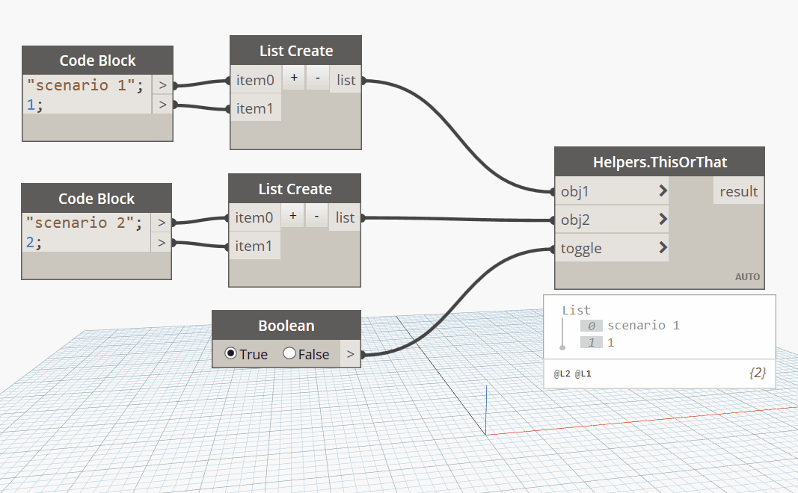

## In Depth

`Helpers.ThisOrThat(obj1, obj2, toggle)`

This provides a toggle input to select between 2 inputs.

The inputs are:

- `obj1` (_list of object_) — First choice.
- `obj2` (_list of object_) — Second choice.
- `toggle` (_boolean_) — True for option 1, false for option 2.

Returns `result` (_object_) — The object.

Found in the library under **Actions**.

___
## Example File

An example graph ships beside this page as `Rhythm.Helpers.Helpers.ThisOrThat.dyn`.

