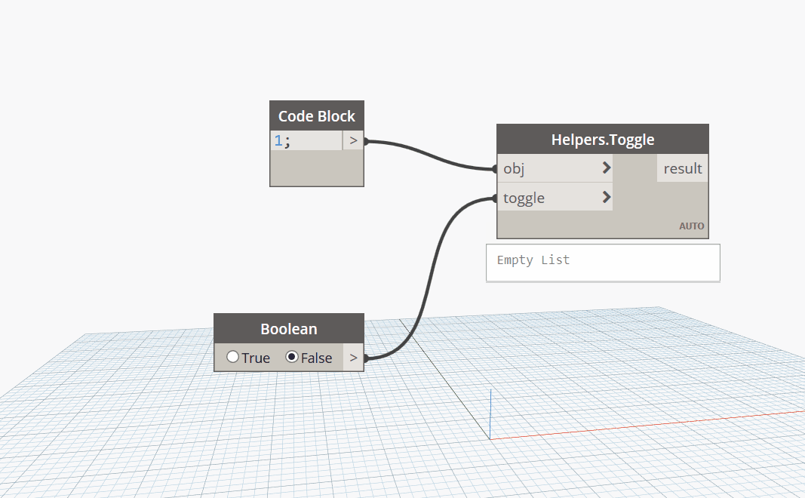

## In Depth

`Helpers.Toggle(obj, toggle)`

This provides a toggle based on boolean input. Replacement for Rhythm.Toggle.

The inputs are:

- `obj` (_list of object_) — The object to passthrough.
- `toggle` (_boolean_) — Toggle the passthrough.

Returns `result` (_object_) — The object.

Found in the library under **Actions**.

___
## Example File

An example graph ships beside this page. Use the panel's insert button to open it.

