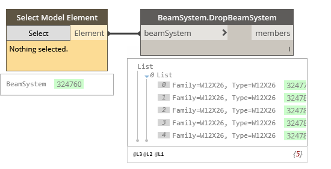

## In Depth

`BeamSystem.DropBeamSystem(beamSystem)`

Drops the beam system.

The inputs are:

- `beamSystem` (_Element_) — The beam system to drop.

Returns `members` (_list of Element_) — The individual members.

Found in the library under **Actions**.

Search terms: `structural`, `beamsystem`.

___
## Example File

