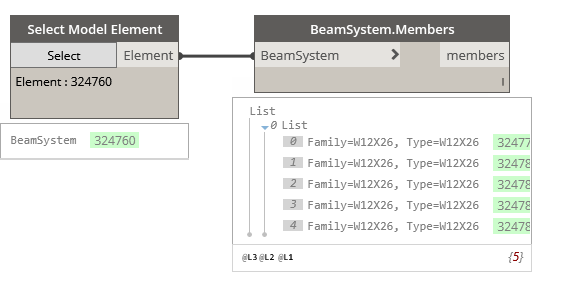

## In Depth

`BeamSystem.Members(BeamSystem)`

Obtains the individual beams within a beam system.

The inputs are:

- `BeamSystem` (_Element_) — The beam system to get information from.

Returns `members` (_list of Element_) — The individual members.

Found in the library under **Query**.

Search terms: `structural`, `beamsystem`.

___
## Example File

