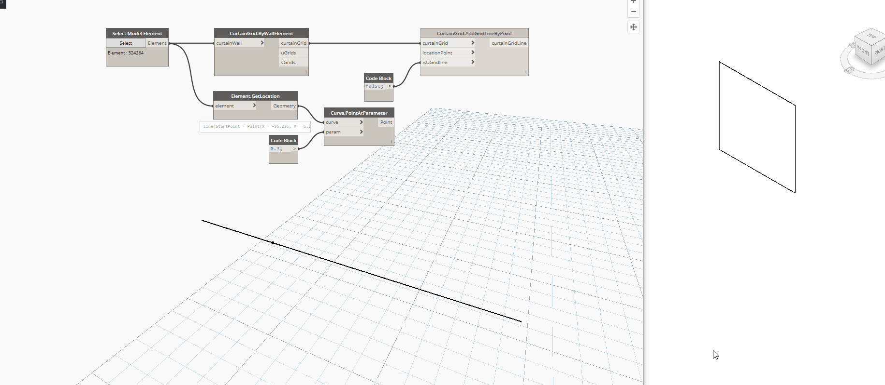

## In Depth

`CurtainGrid.AddGridLineByPoint(curtainGrid, locationPoint, isUGridline)`

This node will add a gridline at the specified place on the curtain wall grid.

The inputs are:

- `curtainGrid` (_CurtainGrid_) — The curtain grid to add a gridline to.
- `locationPoint` (_Point_) — XYZ location to place grid
- `isUGridline` (_boolean_) — Is this gridline horizontal?

Returns `curtainGridLine` (_list of Element_) — The new gridline

Found in the library under **Actions**.

Search terms: `curtainwall`, `rhythm`.

___
## Example File

