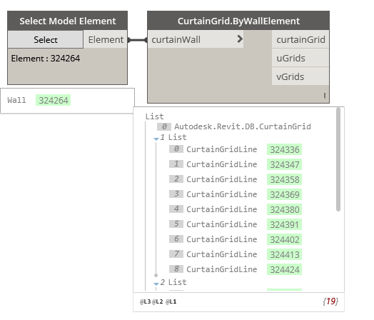

## In Depth

`CurtainGrid.ByWallElement(curtainWall)`

This node will retrieve the curtain grid and U/V Gridlines from the given wall

The inputs are:

- `curtainWall` (_Wall_) — The curtain wall to get data from.

The outputs are:

- `curtainGrid` — The internal curtain grid.
- `uGrids` — The grids in the U direction, (horizontal).
- `vGrids` — The grids in the V direction, (vertical).

Found in the library under **Create**.

Search terms: `curtaingrid`, `rhythm`.

___
## Example File

