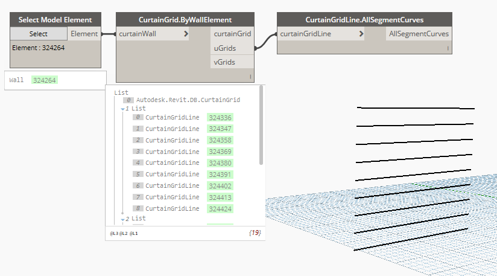

## In Depth

`CurtainGridLine.AllSegmentCurves(curtainGridLine)`

This node will retrieve the geometric curve segments from the curtain wall.

The inputs are:

- `curtainGridLine` (_Element_) — The curtain gridline to get data from.

Returns `AllSegmentCurves` (_object_) — The segments that make up the curtain grid.

Found in the library under **Query**.

Search terms: `CurtainGridLine.FullCurve`, `rhythm`.

___
## Example File

