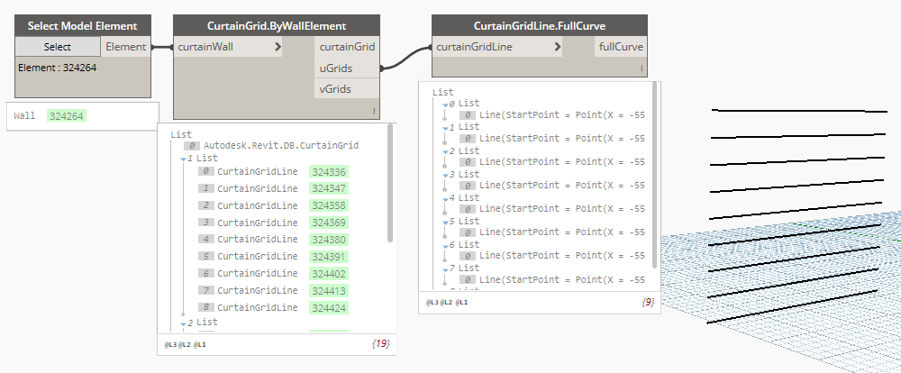

## In Depth

`CurtainGridLine.FullCurve(curtainGridLine)`

This node will retrieve the geometric curve from the curtain wall.

The inputs are:

- `curtainGridLine` (_Element_) — The curtain gridline to get data from.

Returns `fullCurve` (_object_) — The full geometric curve

Found in the library under **Query**.

Search terms: `CurtainGridLine.FullCurve`, `rhythm`.

___
## Example File

