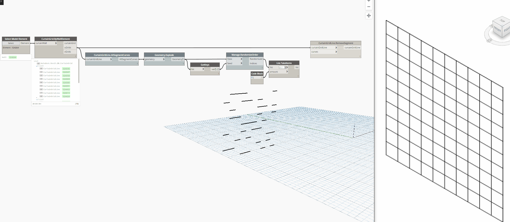

## In Depth

`CurtainGridLine.RemoveSegment(curtainGridLine, curves)`

This node will remove the given curve segments from the curtain grid line.

The inputs are:

- `curtainGridLine` (_Element_) — The curtain gridline to remove segments from.
- `curves` (_list of Curve_) — The curves that represent the grid segment to remove.

Returns `curtainGridLine` (_Element_) — The curtain grid that was supplied.

Found in the library under **Actions**.

Search terms: `CurtainGridLine.RemoveSegment`, `rhythm`.

___
## Example File

