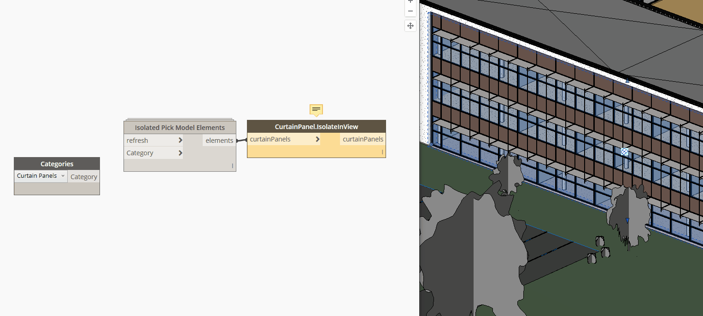

## In Depth

`CurtainPanels.IsolateInView(curtainPanels)`

This node will isolate the given curtain wall panels in the active view.

The inputs are:

- `curtainPanels` (_list of Element_) — The curtain panels to isolate.

Returns `curtainPanels` (_list of Element_) — The isolated curtain panels.

Found in the library under **Actions**.

Search terms: `copy`.

___
## Example File

