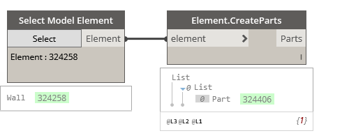

## In Depth

`Elements.CreateParts(element)`

This node will convert the given elements to parts.

The inputs are:

- `element` (_Element_) — The element to convert to parts.

Returns `Parts` (_list of Element_) — The created parts from the given element.

Found in the library under **Actions**.

Search terms: `Element.CreateParts`.

___
## Example File

