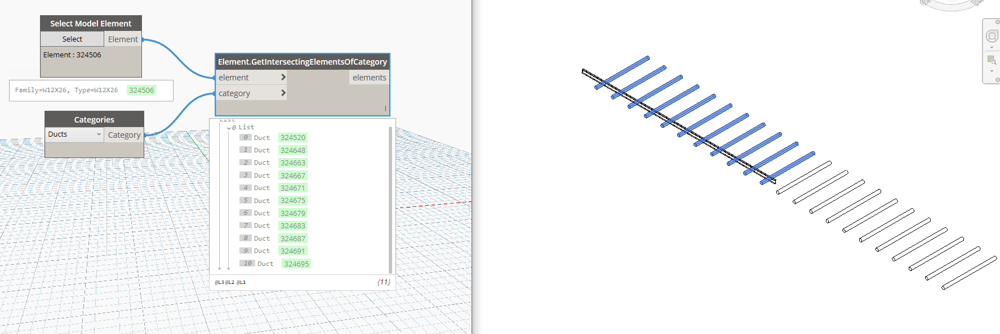

## In Depth

`Elements.GetIntersectingElementsOfCategory(element, category)`

This will take a given element and category and grab the intersecting elements of that category.

The inputs are:

- `element` (_Element_) — The element to run intersections against.
- `category` (_Category_) — The category to check.

Returns `elements` (_list of Element_) — The intersecting elements.

Found in the library under **Query**.

Search terms: `IntersectingElements`.

___
## Example File

