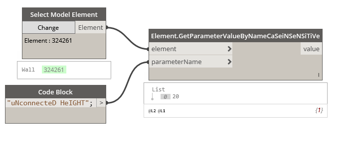

## In Depth

`Elements.GetParameterValueByNameCaSeiNSeNSiTiVe(element, parameterName)`

This node will get a parameter value by search string, regardless of case of the search string. Also accounts for misspellings. Note: If the parameter name appears multiple times it will retrieve the first one that it finds.

The inputs are:

- `element` (_Element_) — The element to get parameter from.
- `parameterName` (_string_) — The parameter name.

Returns `value` (_object_) — The parameter value.

Found in the library under **Actions**.

Search terms: `CaseInsensitive`.

___
## Example File

