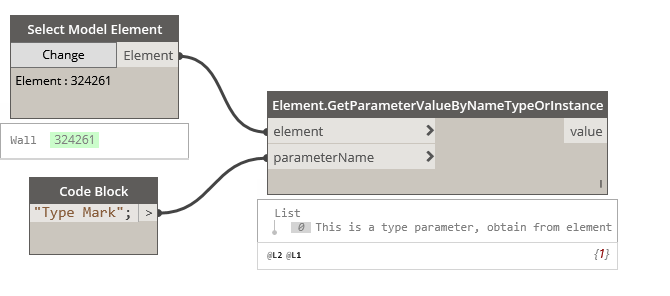

## In Depth

`Elements.GetParameterValueByNameTypeOrInstance(element, parameterName)`

This node will get the parameter as instance or type.

The inputs are:

- `element` (_Element_) — The element to get parameter from.
- `parameterName` (_string_) — The parameter name.

Returns `value` (_object_) — The parameter value.

Found in the library under **Actions**.

Search terms: `TypeOrInstance`.

___
## Example File

