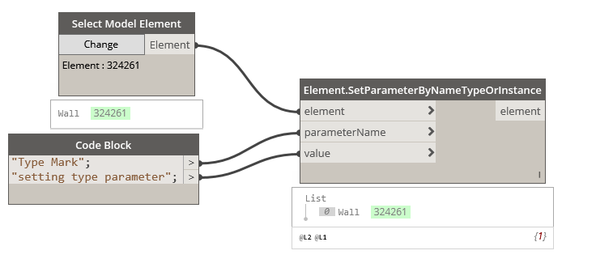

## In Depth

`Elements.SetParameterByNameTypeOrInstance(element, parameterName, value)`

Set one of the element's parameters. Instance if it is instance or type if type.

The inputs are:

- `element` (_Element_) — The element to set parameter to.
- `parameterName` (_string_) — The parameter name.
- `value` (_object_) — The value to set.

Returns `element` (_Element_) — The element.

Found in the library under **Actions**.

Search terms: `TypeOrInstance`.

___
## Example File

