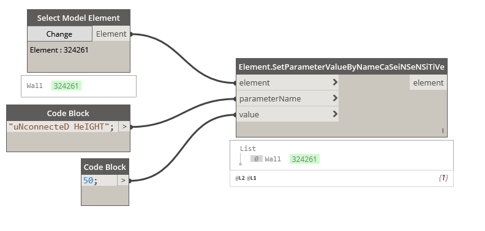

## In Depth

`Elements.SetParameterValueByNameCaSeiNSeNSiTiVe(element, parameterName, value)`

This node will set a parameter value by search string, regardless of case of the search string. Also accounts for misspellings. Note: If the parameter name appears multiple times it will retrieve the first one that it finds.

The inputs are:

- `element` (_Element_) — The element to get parameter from.
- `parameterName` (_string_) — The parameter name.
- `value` (_object_) — The parameter value.

Returns `element` (_Element_) — The element that had parameters set.

Found in the library under **Actions**.

Search terms: `CaseInsensitive`.

___
## Example File

