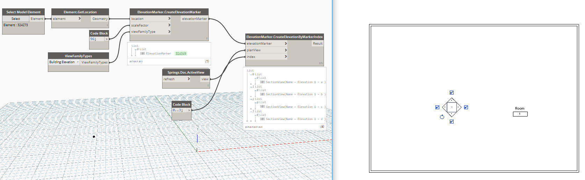

## In Depth

`ElevationMarker.CreateElevationByMarkerIndex(elevationMarker, planView, index)`

This node will add elevations on each side of the marker chosen. Typically 0-3.

The inputs are:

- `elevationMarker` (_Element_) — The marker to host elevations on.
- `planView` (_Element_) — Plan view to do this stuff to.
- `index` (_list of integer_) — This is where the view appears.

Returns `Result` (_list of Element_) — The result

Found in the library under **Create**.

Search terms: `viewport`, `addview`, `rhythm`.

___
## Example File

