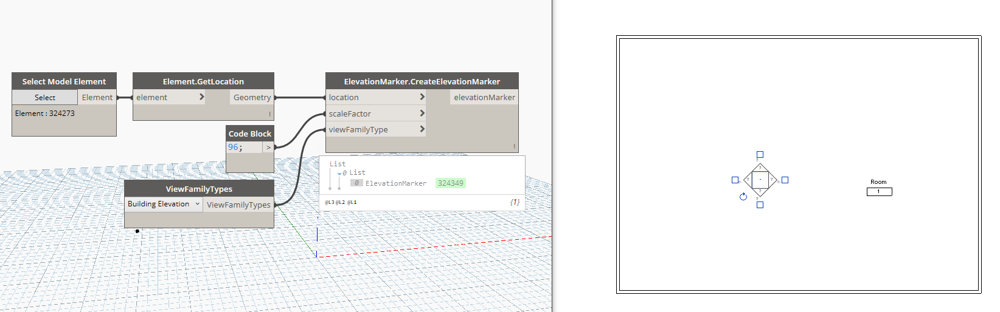

## In Depth

`ElevationMarker.CreateElevationMarker(location, scaleFactor, viewFamilyType)`

This node will create an empty elevation marker at the given points.

The inputs are:

- `location` (_list of Point_) — The location of the view.
- `scaleFactor` (_integer_) — The scale factor of the view in integer value. E.g. "96"
- `viewFamilyType` (_Element_) — The view family type you wish to use.

Returns `elevationMarker` (_list of Element_) — The created elevation marker.

Found in the library under **Create**.

Search terms: `viewport`, `addview`, `rhythm`.

___
## Example File

