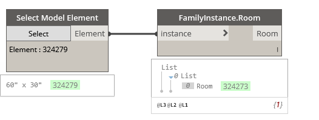

## In Depth

`FamilyInstances.Room(instance)`

This node will report the room the family instance resides in, (if available).

The inputs are:

- `instance` (_list of Element_) — The family instance to obtain room info from.

Returns `Room` (_list of Element_) — The room in which the instance is located (during the last phase of the project).

Found in the library under **Query**.

Search terms: `room`, `rhythm`, `element.room`.

___
## Example File

