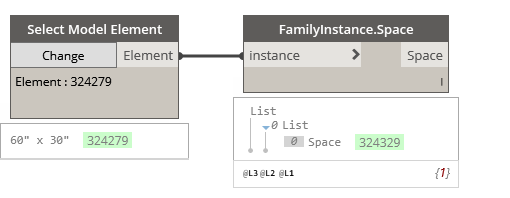

## In Depth

`FamilyInstances.Space(instance)`

This node will report the space the family instance resides in, (if available).

The inputs are:

- `instance` (_list of Element_) — The family instance to obtain space info from.

Returns `Space` (_list of Element_) — The space in which the instance is located (during the last phase of the project).

Found in the library under **Query**.

Search terms: `space`, `rhythm`, `element.space`.

___
## Example File

