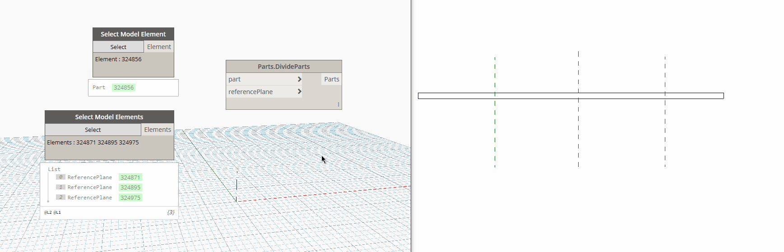

## In Depth

`Parts.DivideParts(part, referencePlane)`

This node will divide the given parts by reference planes.

The inputs are:

- `part` (_Element_) — The part to divide.
- `referencePlane` (_list of ReferencePlane_) — The reference plane to use for the division.

Returns `Parts` (_Element_) — The created parts from the given element.

Found in the library under **Actions**.

Search terms: `Parts.DivideParts`, `rhythm`.

___
## Example File

