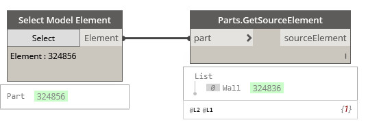

## In Depth

`Parts.GetSourceElement(part)`

Gets the collection of elements from which the parts were created.

The inputs are:

- `part` (_Element_) — The part to get the element from.

Returns `sourceElement` (_Element_) — The created parts from the given element.

Found in the library under **Query**.

Search terms: `Parts.GetSourceElement`, `rhythm`.

___
## Example File

