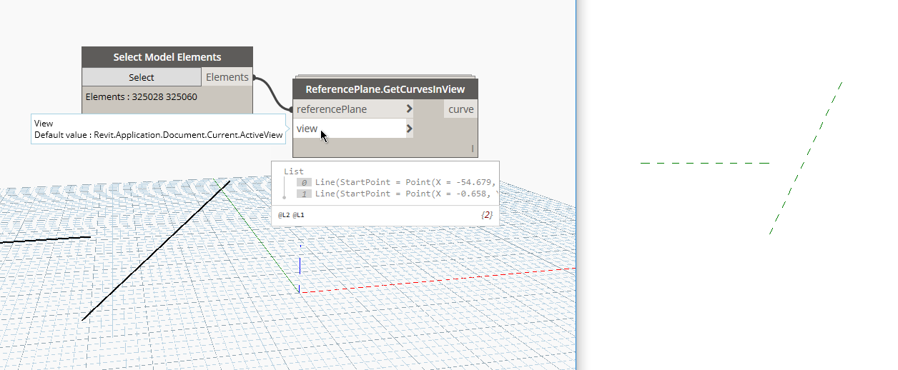

## In Depth

`ReferencePlanes.GetCurvesInView(referencePlane, view)`

This node will get the underlying curve of the reference plane in a given view.

The inputs are:

- `referencePlane` (_list of Element_) — The reference plane to get curves from.
- `view` (_View_) — The view to obtain the curves in.

Returns `curve` (_list of Curve_) — The room that is tagged.

Found in the library under **Query**.

Search terms: `referenceplane`, `referenceplane.getcurvesinview`.

___
## Example File

