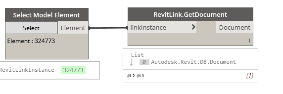

## In Depth

`RevitLink.GetDocument(linkInstance)`

This node will obtain the selected link's document.

The inputs are:

- `linkInstance` (_Element_) — The link to get document from.

Returns `Document` (_Document_) — The document.

Found in the library under **Actions**.

Search terms: `rhythm`.

___
## Example File

