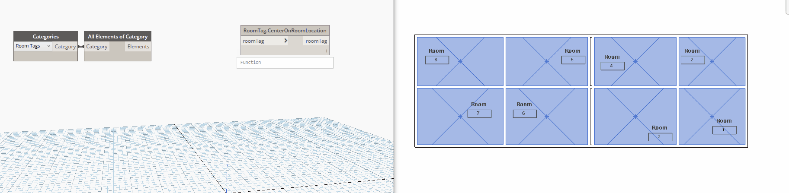

## In Depth

`RoomTag.CenterOnRoomLocation(roomTag)`

This node will set the room tag to the same as the room location.

The inputs are:

- `roomTag` (_list of Element_) — The room tag to set.

Returns `roomTag` (_list of Element_) — The room tag.

Found in the library under **Actions**.

Search terms: `roomtag`, `rhythm`.

___
## Example File

