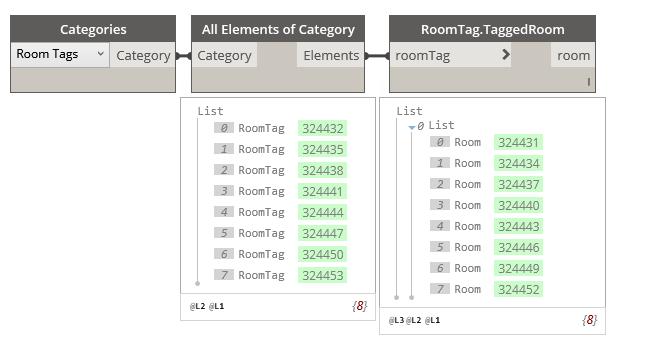

## In Depth

`RoomTag.TaggedRoom(roomTag)`

This node will retrieve the room that a tag is tagging.

The inputs are:

- `roomTag` (_list of Element_) — The room tag to retrieve elements from.

Returns `room` (_list of Element_) — The room that is tagged.

Found in the library under **Query**.

Search terms: `roomtag`, `rhythm`.

___
## Example File

