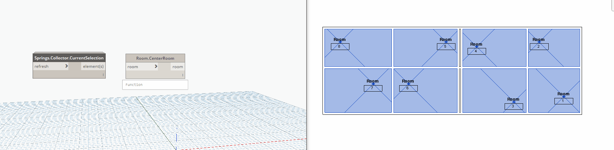

## In Depth

`Rooms.CenterRoom(room)`

This node will center the room.

The inputs are:

- `room` (_list of Room_) — The room to center.

Returns `room` (_list of Room_) — The room.

Found in the library under **Actions**.

Search terms: `roomtag`, `rhythm`.

___
## Example File

