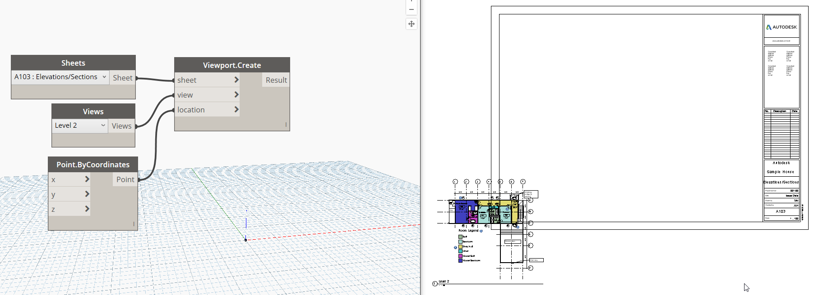

## In Depth

`Viewport.Create(sheet, view, location)`

This node will place the given view on the given sheet, if possible. For floor plan views: They cannot be on any other sheets. Now supports schedules!

The inputs are:

- `sheet` (_Sheet_) — The sheet to place views on.
- `view` (_Element_) — The view to place.
- `location` (_Point_) — The location of the view.

Returns `Result` (_object_) — The result

Found in the library under **Create**.

Search terms: `viewport`, `addview`, `rhythm`.

___
## Example File

