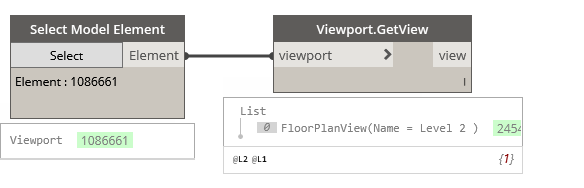

## In Depth

`Viewport.GetView(viewport)`

This node will obtain the view from the given viewport.

The inputs are:

- `viewport` (_Element_) — Viewport to obtain view from.

Returns `view` (_Element_) — The view that belongs to the viewport.

Found in the library under **Query**.

Search terms: `viewport`, `location`, `rhythm`.

___
## Example File

