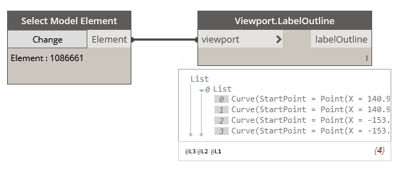

## In Depth

`Viewport.LabelOutline(viewport)`

This node will obtain the outline of the Viewport title if one is used. This is the label outline.

The inputs are:

- `viewport` (_Element_) — Viewport to obtain data from.

Returns `labelOutline` (_list of Curve_) — The label outline of the viewport.

Found in the library under **Query**.

Search terms: `viewport`, `Viewport.LabelOutline`, `rhythm`.

___
## Example File

