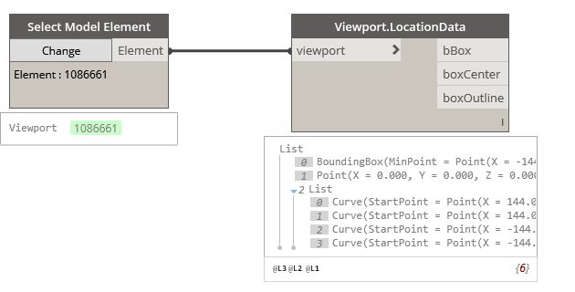

## In Depth

`Viewport.LocationData(viewport)`

This node will obtain the box location data from the provided viewport.

The inputs are:

- `viewport` (_Element_) — Viewport to obtain data from.

The outputs are:

- `bBox` — The bounding box of the viewport.
- `boxCenter` — The center of the viewport.
- `boxOutline` — The outline of the viewport.

Found in the library under **Query**.

Search terms: `viewport`, `Viewport.LocationData`, `rhythm`.

___
## Example File

