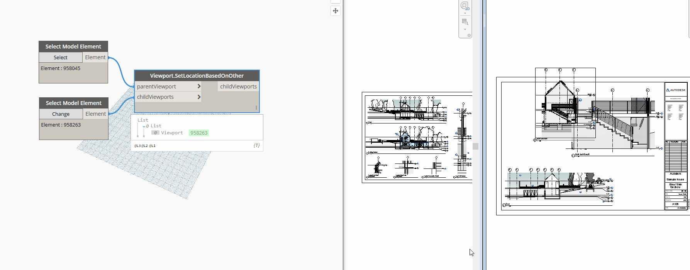

## In Depth

`Viewport.SetLocationBasedOnOther(parentViewport, childViewports)`

This node will set the child viewports box center given the parent viewport.

The inputs are:

- `parentViewport` (_Element_) — Viewport to get location from.
- `childViewports` (_list of Element_) — Viewports to set to location collected.

Returns `childViewports` (_list of Element_) — The viewports you moved.

Found in the library under **Actions**.

Search terms: `viewport`.

___
## Example File

