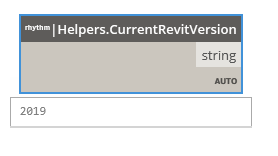

## In Depth

`Helpers.CurrentRevitVersion()`

Returns the current Revit version

Returns `result` (_string_).

Found in the library under **Query**.

___
## About the Helpers nodes

Helpers Wrapper

___
## Example File

An example graph ships beside this page. Use the panel's insert button to open it.

