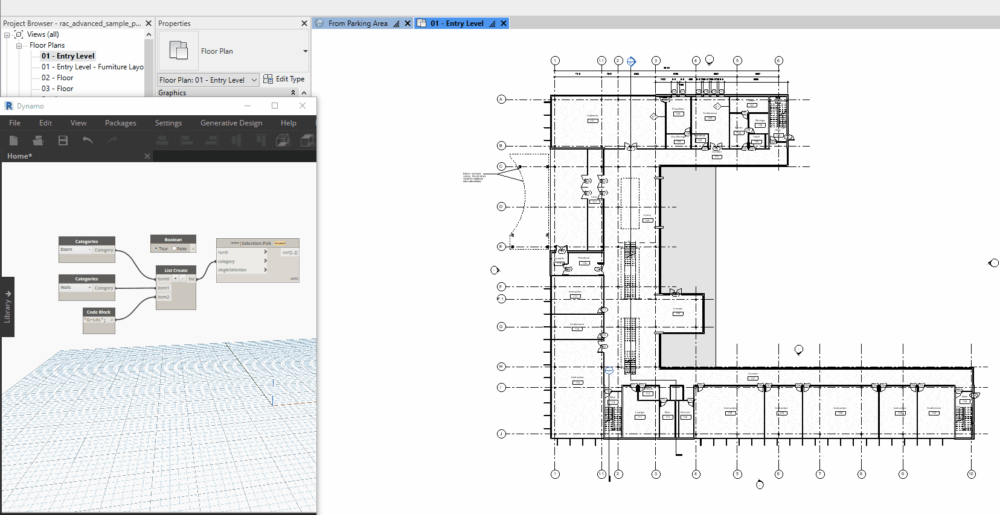

## In Depth

`Selection.Pick(runIt, category: Rhythm.Utilities.MiscUtils.GetNull(), singleSelection: false, ordered: false)`

Sometimes a pick selection is nicer. 😁

The inputs are:

- `runIt` (_boolean_) — Allows you to tell the node to "run". Also allows you to refresh selection.
- `category` (_list of object_, defaults to `Rhythm.Utilities.MiscUtils.GetNull()`) — The category or categories to isolate to. (leave blank if you want to be able to pick anything)
- `singleSelection` (_boolean_, defaults to `false`) — Optional input for a single item selection. Default to multiple.
- `ordered` (_boolean_, defaults to `false`) — Force an ordered selection using esc to finish.

Returns `pickedElements` (_object_).

___
## Example File

An example graph ships beside this page as `Rhythm.Revit.Selection.Selection.Pick.dyn`.

