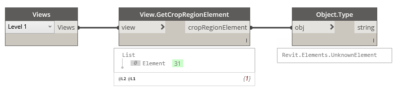

## In Depth

`View.GetCropRegionElement(view)`

This node will obtain the crop region element from the view.

The inputs are:

- `view` (_Element_) — The view to obtain the crop region element from.

Returns `cropRegionElement` (_object_) — The crop region as an element.

Search terms: `crop region`, `rhythm`.

___
## Example File

