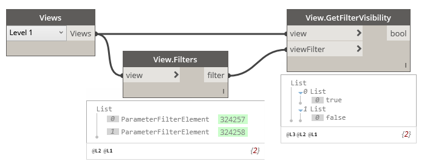

## In Depth

`View.GetFilterVisibility(view, viewFilter)`

This node will supply the visibility of the given filter in given view.

The inputs are:

- `view` (_Element_) — The view to obtain filter visibility from.
- `viewFilter` (_Element_) — The view filter.

Returns `bool` (_boolean_) — The visibility value.

Search terms: `view`, `dependent`, `rhythm`.

___
## Example File

