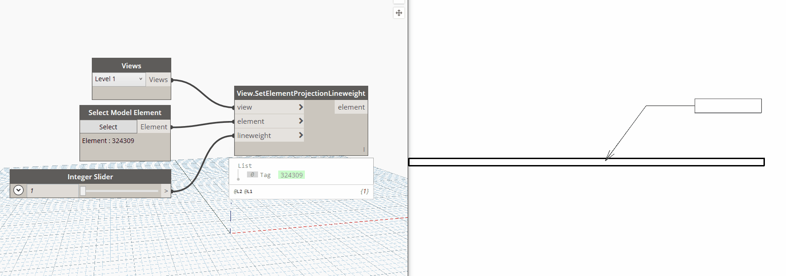

## In Depth

`View.SetElementProjectionLineweight(view, element, lineweight)`

This node will override the given element's projection lineweight in given view.

The inputs are:

- `view` (_Element_) — The view to set the overrides in.
- `element` (_Element_) — The element to override.
- `lineweight` (_integer_) — The lineweight to use.

Returns `element` (_Element_) — The crop region as an element.

Search terms: `crop region`, `rhythm`.

___
## Example File

