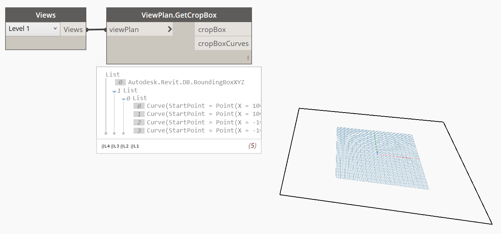

## In Depth

`ViewPlan.GetCropBox(viewPlan)`

This node will get the bounds of the view in paper space (in feet).

The inputs are:

- `viewPlan` (_Element_) — The plan view to get outline from.

The outputs are:

- `cropBox` — The cropBox.
- `cropBoxCurves` — The curves of the crop region.

Search terms: `view`, `outline`, `rhythm`.

___
## Example File

