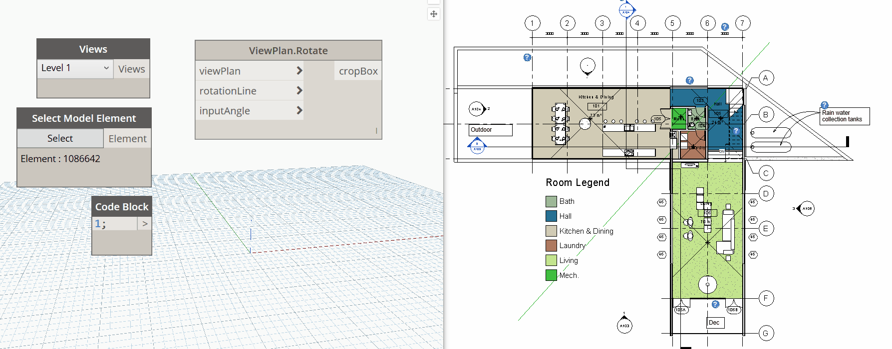

## In Depth

`ViewPlan.Rotate(viewPlan, rotationLine, inputAngle)`

This node will attempt to rotate a plan view into a 3D view. Use at your own risk!

The inputs are:

- `viewPlan` (_Element_) — The plan view to rotate
- `rotationLine` (_Element_) — The line to rotate along.
- `inputAngle` (_number_) — The plan view to get outline from.

Returns `cropBox` (_object_) — The cropBox.

Search terms: `view`, `outline`, `rhythm`.

___
## Example File

