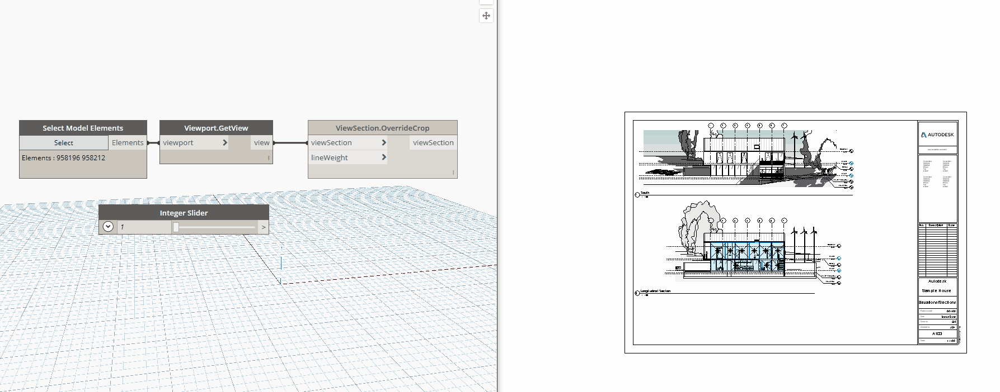

## In Depth

`ViewSection.OverrideCrop(viewSection, lineWeight)`

This node will override the crop region of the given section view based on the pen weight provided. Slower but more reliable version that uses transaction rollback to isolated the crop region element.

The inputs are:

- `viewSection` (_Element_) — The plan view to rotate
- `lineWeight` (_integer_) — The line weight to override to, (1-16)

Returns `viewSection` (_Element_) — The overridden view.

Search terms: `overridecrop`.

___
## Example File

