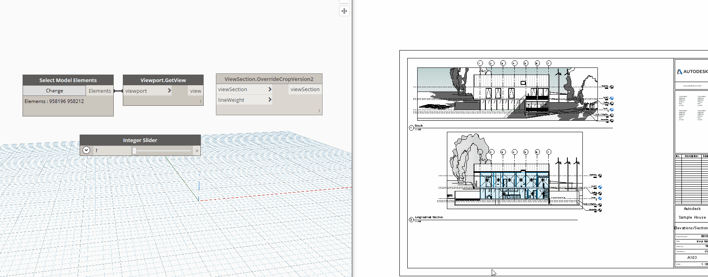

## In Depth

`ViewSection.OverrideCropVersion2(viewSection, lineWeight)`

This node will override the crop region of the given section view based on the pen weight provided. This is the faster version that works with interior elevations.

The inputs are:

- `viewSection` (_Element_) — The plan view to rotate
- `lineWeight` (_integer_) — The lineweight to override to, (1-16)

Returns `viewSection` (_Element_) — The overidden view.

Search terms: `overridecrop`.

___
## Example File

