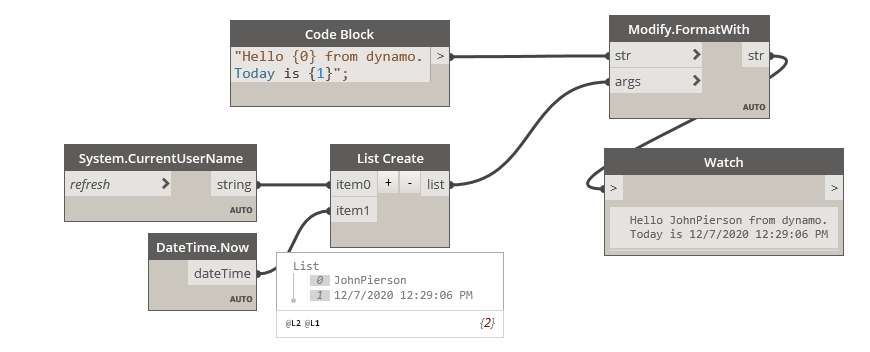

## In Depth

`Modify.FormatWith(str, args)`

Format input string with arguments. Made possible with Humanizer (https://github.com/Humanizr/Humanizer)

The inputs are:

- `str` (_string_) — The string to format.
- `args` (_list of object_) — The params (objects)

Returns `str` (_string_) — The formatted string.

Found in the library under **Actions**.

___
## Example File

An example graph ships beside this page as `Rhythm.String.Modify.FormatWith.dyn`.

