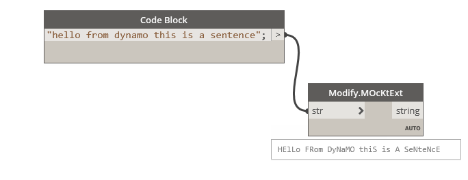

## In Depth

`Modify.MOcKtExt(str)`

This generates a "mocking text" case. Just for fun. 😀

The inputs are:

- `str` (_string_) — _Not documented yet._

Returns `result` (_string_).

Found in the library under **Actions**.

___
## Example File

An example graph ships beside this page. Use the panel's insert button to open it.

