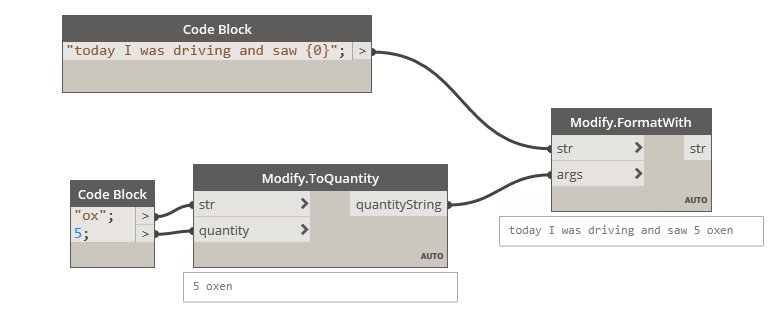

## In Depth

`Modify.ToQuantity(str, quantity)`

This will attempt to return a quantity, given a string and count. Made possible with Humanizer (https://github.com/Humanizr/Humanizer)

The inputs are:

- `str` (_string_) — The string to convert to quantity.
- `quantity` (_integer_) — The amount of things.

Returns `quantityString` (_string_) — The formatted quantity.

Found in the library under **Actions**.

___
## Example File

An example graph ships beside this page as `Rhythm.String.Modify.ToQuantity.dyn`.

