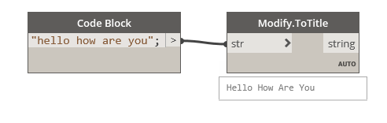

## In Depth

`Modify.ToTitle(str)`

Converts the input string to a title case.

The inputs are:

- `str` (_string_) — _Not documented yet._

Returns `result` (_string_).

Found in the library under **Actions**.

___
## Example File

An example graph ships beside this page as `Rhythm.String.Modify.ToTitle.dyn`.

